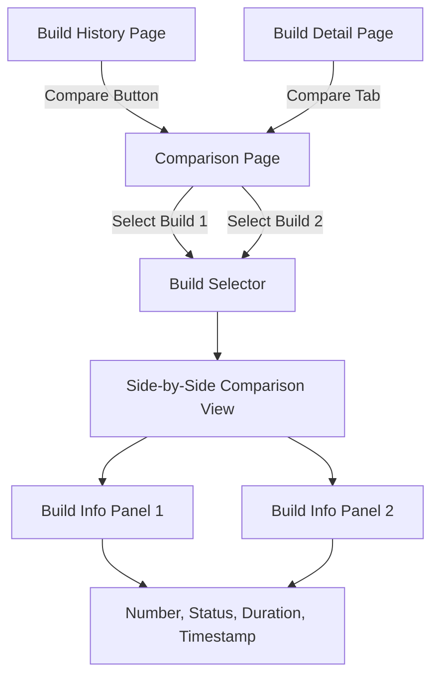

# Build Comparison View Implementation Plan

## Overview

Add a build comparison feature that displays two builds side-by-side, showing basic information (build number, status, duration, timestamp) for easy analysis. The feature will be accessible from both the build history page and individual build pages.

## Architecture

## Implementation Steps

### 1. Create Comparison Tab for Build Pages

- **File**: `core/src/main/java/jenkins/run/ComparisonTab.java`
  - Extend `Tab` class
  - Implement `getIconFileName()`, `getDisplayName()`, `getUrlName()`
  - Store reference to the current build

- **File**: `core/src/main/java/jenkins/run/ComparisonTabFactory.java`
  - Extend `TransientActionFactory<Run>`
  - Return `ComparisonTab` instance
  - Use ordinal to position tab appropriately

- **File**: `core/src/main/resources/jenkins/run/ComparisonTab/index.jelly`
  - Create comparison page layout
  - Include build selector for second build
  - Display side-by-side comparison when both builds selected

### 2. Add Compare Action to Build History

- **File**: `core/src/main/resources/hudson/widgets/HistoryWidget/entry.jelly`
  - Add "Compare" button/link to each build entry
  - Link to comparison page with current build pre-selected

### 3. Create Comparison Page Controller

- **File**: `core/src/main/java/jenkins/run/BuildComparison.java`
  - Handle comparison page requests
  - Accept two build IDs/numbers as parameters
  - Fetch build data for both builds
  - Expose build data to Jelly template

- **File**: `core/src/main/resources/jenkins/run/BuildComparison/index.jelly`
  - Main comparison page template
  - Two-column layout for side-by-side display
  - Build selector dropdowns/inputs
  - Display comparison metrics

### 4. Create Comparison UI Components

- **File**: `core/src/main/resources/jenkins/run/BuildComparison/comparison.jelly`
  - Reusable comparison panel component
  - Display build number, status icon, duration, timestamp
  - Highlight differences visually

- **File**: `src/main/scss/pages/_build-comparison.scss`
  - Styles for comparison layout
  - Side-by-side column styling
  - Difference highlighting styles

### 5. Add JavaScript for Build Selection

- **File**: `src/main/js/pages/build-comparison.js`
  - Handle build selector interactions
  - Update comparison view when builds change
  - Handle URL parameters for pre-selected builds

### 6. Add Routing Support

- Ensure comparison page is accessible via:
  - `{jobUrl}/{buildNumber}/compare` - from build page tab
  - `{jobUrl}/compare?build1={number}&build2={number}` - direct comparison
  - `{jobUrl}/{buildNumber}/compare?build2={number}` - compare with another build

## Key Files to Modify/Create

### New Files:

- `core/src/main/java/jenkins/run/ComparisonTab.java`
- `core/src/main/java/jenkins/run/ComparisonTabFactory.java`
- `core/src/main/java/jenkins/run/BuildComparison.java`
- `core/src/main/resources/jenkins/run/ComparisonTab/index.jelly`
- `core/src/main/resources/jenkins/run/BuildComparison/index.jelly`
- `core/src/main/resources/jenkins/run/BuildComparison/comparison.jelly`
- `src/main/js/pages/build-comparison.js`
- `src/main/scss/pages/_build-comparison.scss`

### Modified Files:

- `core/src/main/resources/hudson/widgets/HistoryWidget/entry.jelly` - Add compare button
- `src/main/scss/pages/_pages.scss` - Import comparison styles

## Data Comparison Points

- Build number
- Build status (Result with icon color)
- Duration (formatted string)
- Timestamp (formatted date/time)
- Display name

## UI/UX Considerations

- Use Jenkins design system components (cards, buttons)
- Ensure responsive layout for side-by-side view
- Highlight differences between builds (e.g., different statuses, duration changes)
- Provide clear navigation back to build pages
- Support keyboard navigation and accessibility
